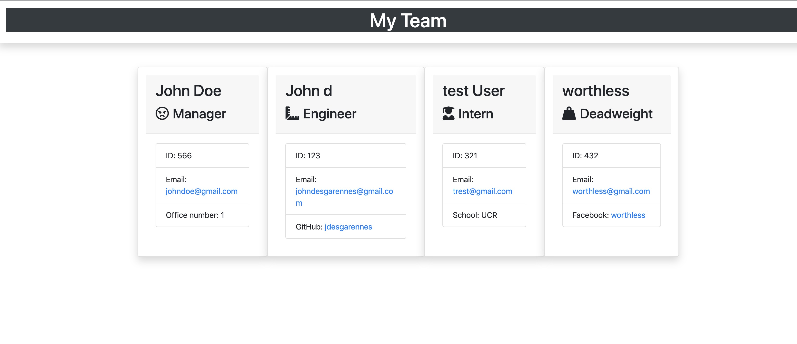

 

  # Title: Team Profile Generator

    
  
  ## Description: Team profile generator creates  a list of team members in cards with specific information. There are three categories including one special one. The generator asks the same questions from the employee class, such as name email and ID, but depending on there title, they will get a unique question. Once everything is entered a HTML page will display cards with the info and a ICON representing there title.

  ## Usage:  First the user is asked a series of common questions. Then the user is asked to pick a title. Depending on the title, the user will be asked an additional question. Then the user will be asked if they want to generate more cards or create the HTML page. This will then create the Page in a specific folder with all of the users input.

  ## Questions: johndesgarennes@gmail.com

  ## Github username: jdesgarennes

  ## License type: MIT

 ## Table Of Contents
 [Title:](#Title)
 [Description:](#Description)
 [Usage:](#Usage)
 [Questions:](#Questions)

  